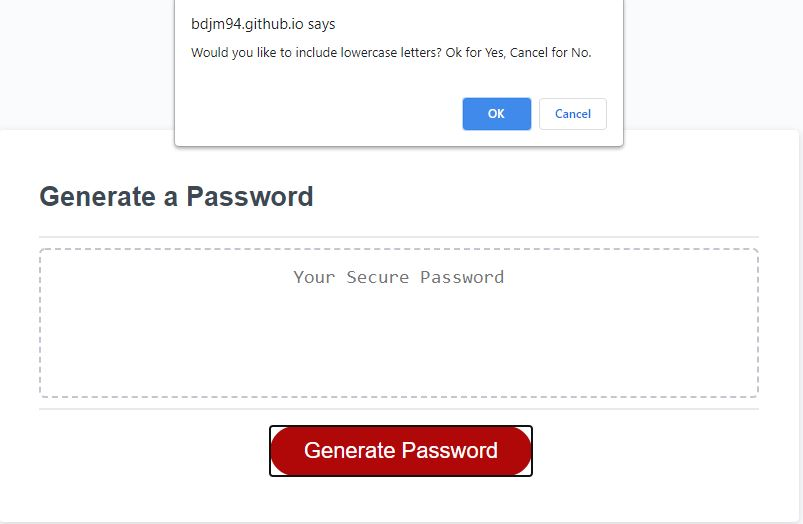

# Random Password Generator

## About
Due to the increase need for password security, the Random Password Generator was designed to output a unique password containing lowercase and uppercase letters, numbers and symobls. Keep your details safe and secure by using a password from this generator!

## Functionality
When opening up the [Password Generator](https://bdjm94.github.io/random-password-generator/), click on the "Generate Password" button and begin the process of choosing your new random password. You will have the option of choosing the length and whether or not you want to include uppercase and lowercase letters, numbers and symbols. Don't forget to copy what is presented and save it in a safe place!

## Password Generator in Use
Home page after clicking on the "Generate Password" button and including a valid character length of 8.

Prompt to choose whether to include lowercase letters or not

Prompt to choose whether to include uppercase letters or not

Prompt to choose whether to include numbers or not

Prompt to choose whether to include symbols or not - group of symbols chosen were !@#$%^&*()_+{}[],.<>/;:

Random password generated after choosing a character length of 8 and clicking OK on every prompt

## Invalid Responses
If you try to choose a password that is outside of the 8 to 128 character range, then you will be presented with the below prompt

Clciking OK will allow you to try again and choose a valid length.

If you choose a valid length, but then click Cancel on all options, then you will be displayed with an Invalid response prompt, stating that no options were selected, and it will ask you to start over.
